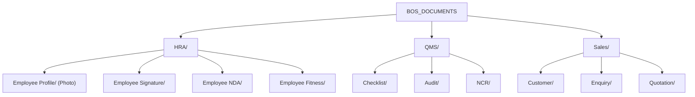

# BOS Document Upload & Cross-Platform Path Resolution Guide

This guide documents the architecture, directory mapping, and cross-platform resolution strategy for files and uploads in the **Autonoma BOS ERP** platform. It provides critical operational context for developers maintaining the codebase in both **Development** and **Production** environments (Windows & Mac/Linux).

---

## 1. Directory Structure & Sub-Module Mapping

All uploaded files are organized under a centralized root directory named `BOS_DOCUMENTS`. Inside this root, subdirectories are dynamically resolved at upload time based on the active sub-module.



> [!NOTE]
> The folders above are strictly defined on the backend in `AppUtil.BosDocConstants.java` and synchronized with `getModuleFromPath()` in `upload-helper.js` on the frontend.

---

## 2. Cross-Platform Root Path Resolution (`FileService.java`)

To prevent files from going missing in production or falling back to temporary directories on Mac/Linux, the `getRootPath()` method in `FileService.java` resolves paths dynamically based on the host OS.

### Path Hierarchy & Standarization:

1. **Company Profile override:** If `directoryPath` is configured in the database's `company_profile` table, the backend attempts to load this custom path.
2. **App Preference override:** If `FILE_LOCATION` is present in the `app_preference` table, it is resolved.
3. **OS-Specific Standarization (Core Hardening):**
   * **Windows Hosts (`os.contains("win")`):** Enforces a standardized system path `D:\BOS_DOCUMENTS` (absolute and persistent).
   * **Mac & Linux Hosts (Non-Windows):** Ignores Windows-specific drive letters from database dumps completely, resolving to a clean directory sitting directly under the workspace root:
     ```java
     resolvedPath = Paths.get("..").toAbsolutePath().resolve("BOS_DOCUMENTS").normalize();
     ```

### Safe Fallback Mechanism:
If creating the primary workspace path fails (due to write permissions), the system applies a cascading fallback hierarchy:
* **Mac/Linux:** Fallback to `~/BOS_DOCUMENTS` (user home directory), and finally `/tmp/BOS_DOCUMENTS` if needed.
* **Windows:** Fallback to local temporary directories.

---

## 3. Frontend Defensive Safeguards & Placeholder Filtering

Legacy databases often initialize unuploaded file paths as `"-"` (hyphen) or strings like `"null"` / `"undefined"`. 

The frontend uses specialized utilities to filter these out, preventing invalid requests that trigger `404 Not Found` console errors.

### 1. Centralized Image Thumbnail Resolver (`BOSUtils.js`)
The `getPhotoUrl` helper safely handles table images and falls back to system placeholders instead of firing requests to broken relative paths:
```javascript
export const getPhotoUrl = (photoPath) => {
  if (!photoPath) return null;
  const cleanPath = String(photoPath).trim();
  if (!cleanPath || cleanPath === '-' || cleanPath === 'null' || cleanPath === 'undefined') return null;
  if (cleanPath.startsWith('http') || cleanPath.startsWith('blob:')) return cleanPath;
  
  return `/api/files/view?path=${encodeURIComponent(cleanPath)}`;
};
```

### 2. Global Document Preview Resolvers (`upload-helper.js`)
Both `getFileViewUrl()` and `getFileDownloadUrl()` sanitize raw database inputs defensively:
```javascript
export const getFileViewUrl = (serverFileName) => {
    if (!serverFileName) return '';
    const clean = String(serverFileName).trim();
    if (!clean || clean === '-' || clean === 'null' || clean === 'undefined') return '';
    // ... constructs absolute URL safely
};
```

### 3. File Input Card Bindings (`EmployeeMaster.jsx`)
When binding data into `BOSFileUpload` cards in forms, the array is guarded dynamically so placeholder string values are treated as empty states:
```javascript
files={(form.employeePhotoUpload && form.employeePhotoUpload !== '-' && form.employeePhotoUpload !== 'null') 
  ? [{ fileName: form.employeePhotoUpload.split('/').pop(), serverFileName: form.employeePhotoUpload, isServer: true }] 
  : []}
```

---

## 4. Production Deployment & DevOps Instructions

### Mounting Persistent Volumes (Docker / Kubernetes)
Because uploaded files are saved locally relative to the backend workspace or an absolute system path, **you must configure persistent volumes** to prevent file loss on container restarts.

#### Example `docker-compose.yml` Configuration:
```yaml
services:
  erp-backend:
    image: autonoma-erp-backend:latest
    ports:
      - "8081:8081"
    volumes:
      # Mount permanent host directory to coordinate with OS standard paths
      - /opt/autonoma/BOS_DOCUMENTS:/app/BOS_DOCUMENTS
      # If running on Windows host, coordinate D:\ drive mounts
      # - d:/BOS_DOCUMENTS:/app/BOS_DOCUMENTS
```

### Database Tuning for Custom Directories
To dynamically direct uploads to a specific drive or NAS mount in production without modifying the codebase:
1. Update `directoryPath` inside the `company_profile` (or `company_credential`) table.
2. OR register a preference named `FILE_LOCATION` inside the `app_preference` table with the target path (e.g. `/mnt/nas/BOS_DOCUMENTS`).
