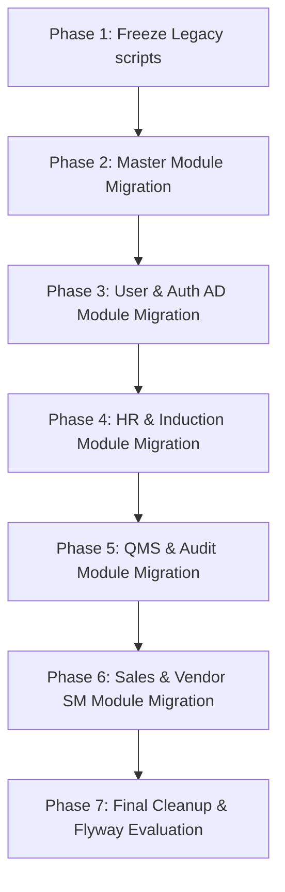

# Database Migration Tracker

This document serves as the official registry and tracking board for standardizing the ERP database schema module by module. 

---

## 1. Migration Roadmap

---

## 2. Module Registry & Progress

| Module Name | Legacy Prefix | Target Prefix | Schema Status | Target Migration Release | Progress |
| :--- | :--- | :--- | :--- | :--- | :--- |
| **Master (Global Common)** | Mixed | `MST_` | Standardized | `V001__Master_Module.sql` | ✅ Migrated |
| **User & Auth (Security/Admin)** | `AD_` / `BOS_` | `AD_` | Legacy | `V002__User_Module.sql` | ❌ Pending |
| **HR & Induction** | `hrm_` / `IND_` | `HR_` | Legacy | `V003__HR_Module.sql` | ❌ Pending |
| **QMS & Audit** | `QMS_` / `qms_` | `QMS_` | Legacy | `V004__QMS_Module.sql` | ❌ Pending |
| **Sales, Vendor & CRM (SM)** | `sm_` | `SLS_` / `VND_` | Legacy | `V005__Sales_Vendor_Module.sql` | ❌ Pending |
| **Support Ticket** | `ticket_` | `TCK_` | Legacy | `V006__Ticket_Module.sql` | ❌ Pending |

*Status key: ❌ Pending | 🔄 In Progress | ✅ Migrated*

---

## 3. Detailed Database Standardization & Design Rules

To resolve performance, size constraints, and migration script failures, all standardization baselines written to the `v_next/` migration path must follow these rules:

### A. Data Types & Storage Optimization
1. **Switch to NVARCHAR:** Migrate all character data fields (`VARCHAR`, `CHAR`, `TEXT`) to `NVARCHAR` for dynamic storage allocation and Unicode support.
2. **Optimize Length Limits:** Do not assign arbitrary `NVARCHAR(255)` or `NVARCHAR(MAX)` limits. Strictly size columns down to match realistic expected value lengths (e.g. 20 to 30 characters for simple codes, names, or reference tags).
3. **Avoid TEXT Data Type:** Never use the legacy `TEXT` data type. Use `NVARCHAR(MAX)` only for large text bodies, or smaller custom limits (like `NVARCHAR(1000)`) for standard paragraphs.
4. **URL & Attachment Paths:** Columns storing file attachments, profile photos, or KYC files (such as `HR_EMPLOYEE_KYC` or induction attachments) must store **relative, URL-specific paths** (e.g. `/uploads/kyc/doc_name.png`) instead of local absolute filesystem paths, and be configured as `NVARCHAR(1000)` instead of `NVARCHAR(MAX)`.

### B. Foreign Key & Dependency Conflict Reduction
1. **Reduce Foreign Keys:** Minimize foreign key relationships to prevent circular dependency locks during table cleanups or migrations.
2. **Strict FK Use-Cases:** Foreign keys must ONLY be defined to link Master and Transaction tables (e.g., mapping a checklist definition to its assignment list) or when defining standard Audit columns.
3. **Remove Metadata/Status FKs:** Avoid setting up database-level foreign key constraints for status codes (e.g. `status_id` pointing to `ad_status_master`) or minor mapping details. Handle validation at the application service level instead. This prevents migration `DELETE` scripts from crashing due to dependency locks.

### C. Standard Audit Columns on Tables
It is highly recommended that all core tables (such as master, employee, transaction, and primary entities) include the following 5 columns:
*   `CREATED_BY NVARCHAR(100)`
*   `CREATED_DATE DATETIME`
*   `UPDATED_BY NVARCHAR(100)`
*   `UPDATED_DATE DATETIME`
*   `IS_ACTIVE BIT DEFAULT 1`

*Note: Minor mapping tables or simple helper join tables may omit these auditing columns if they do not store user-created transaction data.*

---

## 4. Module-by-Module Migration Details

### Module 1: Master (Global Common)
*   **Legacy Tables:**
    *   `MASTER_COUNTRY`
    *   `MASTER_STATE`
    *   `product_master`
    *   `freight_master`
    *   `mode_of_despatch`
*   **Standardized Schema Target:**
    *   `MST_COUNTRY` (PK: `PK_MST_COUNTRY`)
    *   `MST_STATE` (PK: `PK_MST_STATE`, FK: `FK_MST_STATE_COUNTRY`)
    *   `MST_PRODUCT` (PK: `PK_MST_PRODUCT`)
    *   `MST_FREIGHT` (PK: `PK_MST_FREIGHT`)
    *   `MST_DESPATCH_MODE` (PK: `PK_MST_DESPATCH_MODE`)

---

### Module 2: User & Auth (Security/Admin)
*   **Legacy Tables:**
    *   `AD_USER_CREDENTIALS` / `ad_user_credential`
    *   `AD_COMPANY_CREDENTIAL`
    *   `ad_division_master`
    *   `AD_USER_COMPANY_MAPPING`
    *   `AD_USER_DIVISION_MAPPING`
    *   `AD_USER_SESSION_ACTIVITY`
    *   `AD_USER_SESSION_AUDIT`
    *   `ad_user_theme_setting`
    *   `bos_modules`
    *   `bos_sub_modules`
    *   `bos_pages`
    *   `bos_user_page_auth`
*   **Standardized Schema Target:**
    *   `AD_USER_CREDENTIAL`
    *   `AD_COMPANY_CREDENTIAL`
    *   `AD_DIVISION`
    *   `AD_USER_COMPANY_MAPPING`
    *   `AD_USER_DIVISION_MAPPING`
    *   `AD_USER_SESSION_ACTIVITY`
    *   `AD_USER_SESSION_AUDIT`
    *   `AD_USER_THEME_SETTING`
    *   `AD_MODULE`
    *   `AD_SUB_MODULE`
    *   `AD_PAGE`
    *   `AD_PAGE_AUTH`

---

### Module 3: HR & Induction
*   **Legacy Tables:**
    *   `hrm_employee_master`
    *   `hrm_department_master`
    *   `hrm_designation_master`
    *   `hrm_designation_level`
    *   `hrm_employee_contact`
    *   `hrm_employee_personal_detail`
    *   `hrm_employee_kyc`
    *   `hrm_employee_education`
    *   `hrm_employee_experience`
    *   `IND_INDUCTION_MASTER`
    *   `IND_INDUCTION_ASSIGNMENT`
    *   `IND_INDUCTION_TRAINING_DETAIL`
    *   `IND_INTERVIEW_MASTER`
*   **Standardized Schema Target:**
    *   `HR_EMPLOYEE`
    *   `HR_DEPARTMENT`
    *   `HR_DESIGNATION`
    *   `HR_DESIGNATION_LEVEL`
    *   `HR_EMPLOYEE_CONTACT`
    *   `HR_EMPLOYEE_PERSONAL`
    *   `HR_EMPLOYEE_KYC` (URL column stores relative paths, type `NVARCHAR(1000)`)
    *   `HR_EMPLOYEE_EDUCATION`
    *   `HR_EMPLOYEE_EXPERIENCE`
    *   `HR_INDUCTION`
    *   `HR_INDUCTION_ASSIGNMENT`
    *   `HR_INDUCTION_TRAINING`
    *   `HR_INTERVIEW`

---

### Module 4: QMS & Audit
*   **Legacy Tables:**
    *   `qms_checklist_master`
    *   `qms_checklist_assignment`
    *   `QMS_CHECKLIST_CLOSED`
    *   `QMS_AUDIT_SCHEDULE`
    *   `QMS_AUDIT_ATTENDANCE`
    *   `QMS_AUDIT_OBSERVATION`
    *   `qms_meeting_master`
    *   `qms_meeting_schedule`
    *   `qms_mom_master`
    *   `qms_mom_detail`
    *   `QMS_NCR_OFI_MASTER`
*   **Standardized Schema Target:**
    *   `QMS_CHECKLIST`
    *   `QMS_CHECKLIST_ASSIGNMENT`
    *   `QMS_CHECKLIST_CLOSED`
    *   `QMS_AUDIT_SCHEDULE`
    *   `QMS_AUDIT_ATTENDANCE`
    *   `QMS_AUDIT_OBSERVATION`
    *   `QMS_MEETING`
    *   `QMS_MEETING_SCHEDULE`
    *   `QMS_MOM`
    *   `QMS_MOM_DETAIL`
    *   `QMS_NCR_OFI`

---

## 5. Workflow & Local Testing Guidelines

1. **Local Pre-Commit Testing:** Developers must pull the latest changes from the `main` branch, compile the codebase, verify database migrations, and run the workflow locally. Only push to `main` once they verify zero runtime errors.
2. **Error Reporting Strategy:** Whenever an error is encountered on the live console during testing or production setup, developers must instantly take a screenshot and share it directly in the internal group chat for collective troubleshooting.
